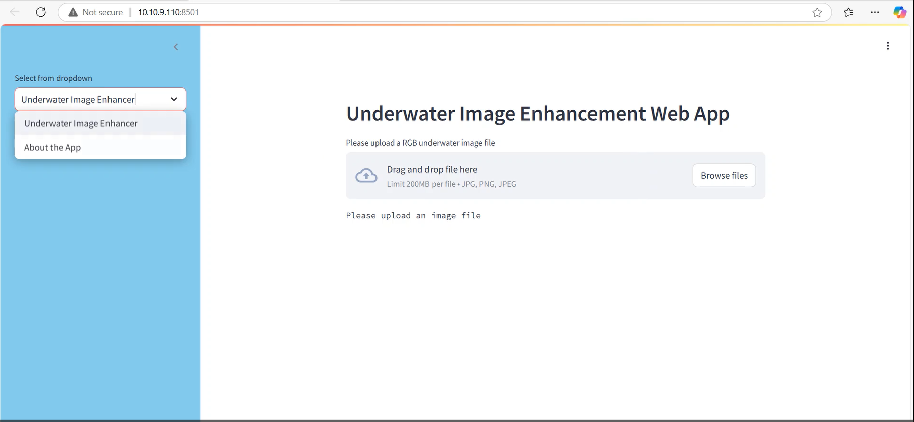
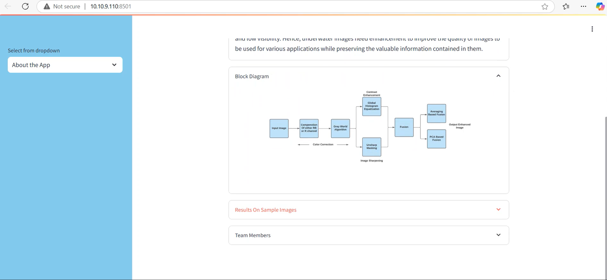
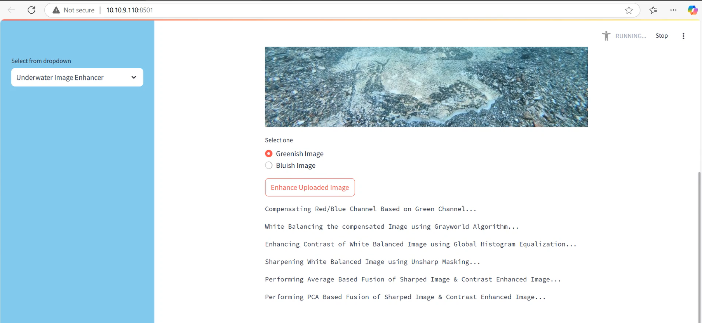
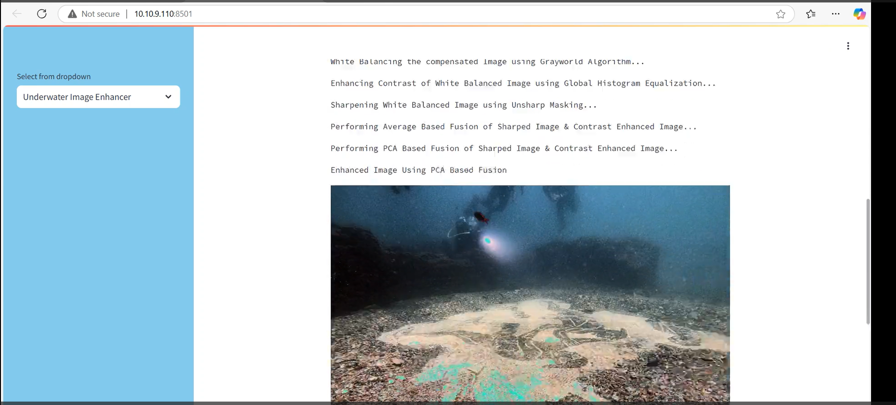
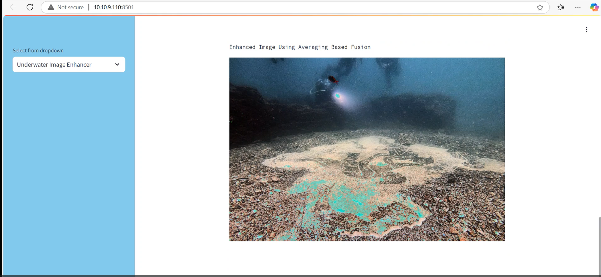

# 🌊 Underwater Image Enhancement  

A Python-based image processing project designed to **enhance underwater images** by improving color balance, contrast, and visibility through advanced algorithms and image fusion techniques.  

---

## 🧩 Problem Statement  
Underwater imaging poses significant challenges due to the unique optical properties of water.  
Unlike air, water **absorbs and scatters light**, resulting in:  
- **Color distortion** (especially red light loss)  
- **Low contrast and haziness**  
- **Reduced visibility and sharpness**  

These challenges severely impact the performance of underwater applications such as:  
- Marine biology and coral monitoring  
- Underwater archaeology  
- Search and rescue operations  
- Autonomous underwater robotics  

---

##  Solution Overview  
This project aims to **restore and enhance underwater images** by reducing noise, correcting color imbalance, and improving contrast.  
The implemented enhancement pipeline increases image visibility and produces visually balanced and realistic results.

Our approach applies multiple image enhancement operations including:  
- Noise reduction  
- Color correction (Gray World Algorithm)  
- Contrast enhancement (Histogram Equalization + Image Fusion)  

---

## ⚙️ Workflow Overview  

###  1. Noise Reduction  
- The process starts by **smoothing** the image to reduce background noise.  
- Image compensation is applied to balance **R (Red)** and **B (Blue)** channels.  
- This helps recover the natural tones absorbed by water.

###  2. Color Correction  
- Applied using the **Gray World Algorithm**, a white-balancing method.  
- Each RGB channel is corrected individually to achieve accurate and balanced colors.  
- The resulting image shows improved **color consistency** and **natural appearance**.

###  3. Contrast Enhancement  
- The next step enhances the **object visibility and overall clarity** of the image.  
- The operations include:  
  1. Image sharpening of the white-balanced image  
  2. Global Histogram Equalization  
  3. Unsharp Masking to enhance details  
  4. **Fusion** of sharpened and contrast-enhanced images  

- Multiple fusion strategies are used:  
  - **Averaging-based fusion**  
  - **PCA-based fusion (Principal Component Analysis)**  

### 📏 4. Image Quality Evaluation  
- The quality of enhanced images is evaluated using **PSNR (Peak Signal-to-Noise Ratio)** and other image quality metrics.  

---

##  Tools & Technologies  

| Category | Details |
|-----------|----------|
| **Editor** | Jupyter Notebook |
| **Programming Language** | Python |
| **Main Libraries** | numpy, pandas, opencv-python, tqdm, PyQt5, imutils, matplotlib, scikit-learn, scikit-image, colormath, scipy, Pillow, ultralytics, pytest-shutil |
| **Environment** | Jupyter Notebook / Google Colab |
| **OS Compatibility** | Windows / Linux / macOS |

---

## 🧪 Implementation Steps  

1. Import image and required libraries  
2. Apply **noise reduction** and color compensation  
3. Perform **white balancing using Gray World Algorithm**  
4. Apply **Global Histogram Equalization** for contrast improvement  
5. Apply **Unsharp Masking** for sharpening  
6. Perform **image fusion** (averaging-based or PCA-based)  
7. Evaluate image quality using **PSNR** and visualize results  

---

## 🧭 WebApp View 

---

---

## 🧮 Mathematical Concepts Used  

- **Gray World Algorithm:**  
  Adjusts each color channel so that the average color of an image becomes gray.  

- **Global Histogram Equalization:**  
  Improves contrast by redistributing pixel intensity.  

- **PCA-Based Fusion:**  
  Combines the most informative components from multiple enhanced images.  

---

## To explore full project , please check the Project Video

